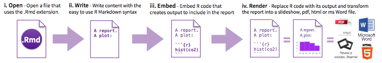
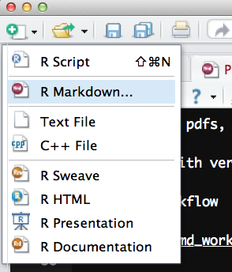
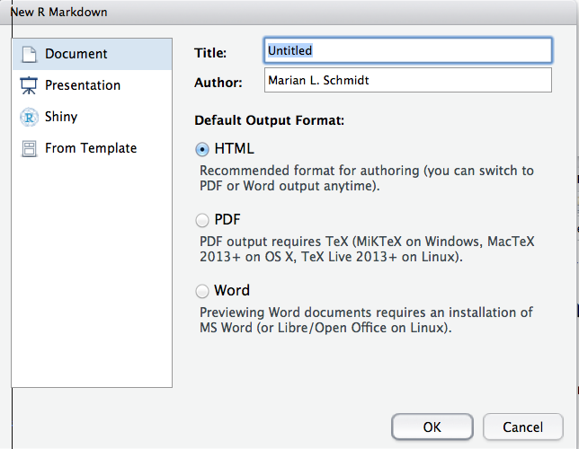
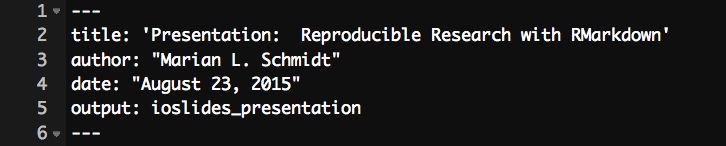
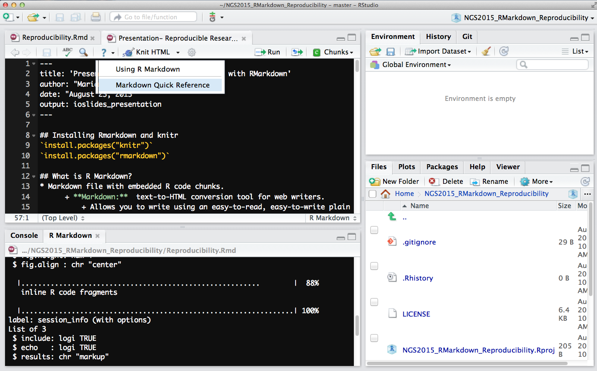
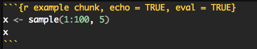
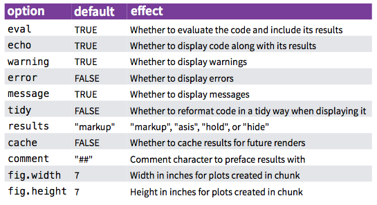
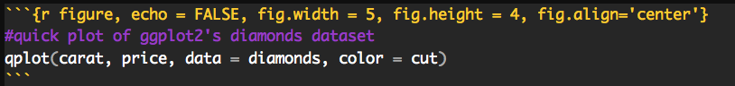
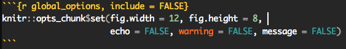
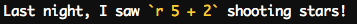

## The Agenda 
1. What is **robust and reproducible research**?  
2. How can you make **your research** more **robust and reproducible**?  
3. You can use RMarkdown!  Wait, what's RMarkdown?
4. How to use RMarkdown and why it will change your workflow - it's awesome.  
5. Using **git** through RStudio.  It's so easy!  
6. Initialize your first reproducible github repo within RStudio!

## Learning Goals  
1. Walk away knowing what **robust and reproducible research** are.  
2. To know the changes you can make to your research to make it more **robust and reproducible.**  
3. To understand what RMarkdown *is.*
4. To know how to create an RMarkdown document and understand it's uses for code sharing. 
5. To understand how to use **git** through the RStudio interface.
6. Know how to initialize a reproducible github repo within RStudio!

## Who is Marian Schmidt?  
- I'm a native Michigander who likes to code in R.
- PhD Candidate in EEB at the UMich in [Vincent Denef's Lab](http://www-personal.umich.edu/~vdenef/).  
- My dissertation is focused on the spatial and temporal distributions and activities of freshwater bacteria. I get to work in this beautiful place...


##  
When I'm not doing science-y things, you can find me here:  
 

## How to replicate my Figure 1?


## To replicate my figure 1, we need...  
- Sequencing data!
- Metadata (i.e. where in the water column it was sampled, particle-association, which lake, nutrient profile, mixing status)  
- The code!  
    + Very well commented and documented.  
          + Using set.seed! 
    + How did I calculate observed richness?  
    + WTF is "Simpson's Evenness"?  
- The versions of the software and packages/libraries used


## As scientists, it should be our goal to perform **robust** and **reproducible** research.

- "**Robust research** is about doing small things that stack the deck in your favor to prevent mistakes." *~Vince Buffalo*
- **Reproducible research** may be repeated by other researchers with the same results. 

## Reproducibility can be difficult with genomic data.  
1. Genomics data is too large and high dimensional to easily inspect or visualize.  Usually, workflows involve multiple steps and it's not feasible to inspect every step.  
2. Unlike in the wet lab, we don't always know what to expect of our genomics data analysis.  
3. It's difficult to distinguish *good* from *bad* results.  
4. Scientific code is usually only run once to generate results for a publication, and is therefore more likely to contain (silent) bugs.  
    + **Silent errors** arise from code that may produce unknowingly incorrect output (rather than stop with an error message).


## What are the ingredients to robust and reproducible research?  

- **Work must be well documented!  Methods, code, and data must be made available to others!**  
- Adopt a cautious attitude and *check everything*.    
    + Vince Buffalo's golden rule of bioinformatics:  "Never ever trust your tools (or data)"  
    + Remember, "garbage in, garbage out" - an analysis is only as good as the data going in.


## What's the benefit for **_you?_**  
Yeah, it takes a lot of effort to be robust and reproducible.  However, *it will make your life (and science) easier!*  

- Most likely, you will have to re-run your analysis more than once.  
- In the future, you or a collaborator may have to re-visit part of the project.  
- You can make modularized parts of the project into re-useable tools for the future.  
    + Let me re-phrase: **Take the time to develop fequently used scripts into tools.**  
        + Then have your lab mates or collaborators test them and try to break them.


## 5 Recommendations for Robust Research  


## 1a. Write code for humans

**Code readability is very important.**  Code should be readable and broken down into small chunks that may be re-used.  (Do not re-write code to do the same task over and over again.)  

+ Comment code  
+ Adopt a [style guide](https://github.com/google/styleguide) 
    
If your code is more readable, then:  

- Your project is more reproducible.  
- It's easier to find and correct bugs.  
- You will be your friend in the future when you revisit the code.

## 1b. Write data for computers

**Let your computer do the work for you**  
Format your data so its easily read by your computer, not by you or other humans.  

- Code written for people to read requires cleaning and tidying to be processed by a computer.  
- Name data files in a consistent way.  
    + Automating tasks will be easier, which will prevent you from making trivial mistakes.

## 2. Make assertions and be loud, in code and in your methods  
Add tests within your code to make sure your code is doing what it is supposed to do.  

- In R you can use `stopifnot()`  
    + The `testthat` package is made for this!  Check it out the [testthat package here](http://journal.r-project.org/archive/2011-1/RJournal_2011-1_Wickham.pdf)  
- In python you can use `assert()`

## 3. Use existing libraries (packages) whenever possible  
- Do not try to re-invent the wheel while your performing your data anaylsis.  
- Use functions that have already been written and tested for you.

## 4. Prevent catastrophe and help reproducibility by making your data **read-only**
Read-only is important because:  

- Modifying data can corrupt your results.  Therefore, making it less reproducible.  
- It's easy to lose track of how you have changed a file when you modify it in place.  

## 5. Let data prove that it's high quality

## 5 Recommendations for Robust Research  
1. Write code for humans, write data for computers  
2. Make assertions and be loud, in code and in your methods  
3. Use existing libraries (packages) whenever possible  
4. Prevent catastrophe and help reproducibility by making your data **read-only**  
5. Let data prove that it's high quality


## 6 Recommendations for reproducible research  


## 1. Encapsulate the full project into one directory that is supported with version control.  
The **Reproducible-Science-Curriculum** [Github repo for Reproducible Research Project Initialization](https://github.com/Reproducible-Science-Curriculum/rr-init) is a great place to start a reproducible research project.  

## 2. Release your code and data
It is simple.  Without your code and data, your research is not reproducible.

## 3. Document everything!   
**Bottom line:  Adopt a computing notebook that is as good as a wet-lab notebook**.

To fully reproduce a study, each step of analysis must be described in much more detail than can be included in a publication.

Include a record of your steps, where files are, where they came from, and what they contain.  

Include `session_info()` in your document, preferably at the bottom. Session info lists the version of R that you’re using plus all of the packages you’ve loaded. 

## In your computing notebook:  

- Document your methods and workflows  
- Document the origin of all data in your project directory  
- Document **when** and **how** you downloaded the data  
- Record **data** version info   
- Record **software** version info with `session_info()`

For example, all the above information could be stored in a *README* file 


## 4. Make figures, tables, and statistics the results of scripts.

Using `inline code` can make the creation of tables much easier if the data changes!

## 5. Write code that uses relative paths.

- Do not rely on hard-coded absolute paths (i.e. /Users/marschmi/Data/seq-data.csv or even ~/Data/seq-data.csv).  

- Relative paths (i.e. Data/seq-data.csv) or command line arguments are better alternatives.

## 6. Always Set your seed  

If there is any randomizations of data or simulations, use `set.seed()` in the first code chunk.

[Karl Browman](http://kbroman.org/knitr_knutshell/pages/reproducible.html) suggests to open R and type runif(1, 0, 10^8) and then paste the resulting large number into `set.seed()` in the first code chunk. If you do this, then the random aspects of your analysis should be repeated the same way.


## 6 Recommendations for reproducible research  
1. Encapsulate the full project into one directory that is supported with version control.  
2. Release your code and data.  
3. Document everything and use code as documentation!
4. Make figures, tables, and statistics the results of scripts.  
5. Write code that uses relative paths.  
6. Always Set your seed.  


## How can you revise your work flow?  
Chat with your neighbor about your workflow.  

- Where you can introduce **robust** steps?  
- Where can you add **reproducible** steps?


## Do you have RStudio, R, and github all configured?
Yes?  Then, please install **Rmarkdown** and **knitr** 

`install.packages("knitr")`
`install.packages("rmarkdown")` 

No?  Take the time to do it now, please.  


## RMarkdown Time!
    
    
## What is R Markdown?   
* RMarkdown is a variant of Markdown that has embedded R code chunks to be used with `knitr` to make it easy to create reproducible web-based reports.  
      + **Markdown:**  A system for writing simple, readable text that is easily converted to html. 
          + Allows you to write using an easy-to-read, easy-to-write plain text format.              
*  Rmd -> md -> html (docx, pdf)  
*  Can include both text and code to execute  
      
    
## Why R Markdown?
A convenient tool for reproducible and dynamic reports with R!       

- Execute code with `knitr`.   
- Easy to learn syntax.  
- Include LaTeX equations.  
- Don't need to worry about page breaks or figure placement.  
- Consolidate your code and write up into a single file:  
    + Slideshows, pdfs, html documents, word files  
- It's **so easy** to use with version control with Git!   

## Simple Workflow




## How to Open an Rmd File
  

## How to Open an Rmd File



## Choose Output


**YAML:**  A set of key value pairs at the start of your file.  Begin and end the header with a line of three dashes (- - -)

***R Studio template writes the YAML header for you***  

output: html_document  
output: pdf_document  
output: word_document  
output: beamer_presentation (beamer slideshow - pdf)  
output: ioslides_presentation (ioslides presentation - html)  


## Markdown basics 
Markdown is a simple formatting language that is easy to use

- Create lists with `*` or `+` sign   
      + like this
      + and this
- Use one or two asterisk marks to provide emphasis such as `*`*italics*`*` and `**`**bold**`**`.  Can even include tables:    

First Header  | Second Header
------------- | -------------
Content Cell  | Content Cell
Content Cell  | Content Cell


## Markdown basics 


## R Code Chunks 

```
Code blocks display with fixed-width font
```

```{r fig.width = 4, fig.height = 3, message = FALSE}
#quick summary
library(ggplot2)
min(diamonds$price)
mean(diamonds$price)
max(diamonds$price)
```


## R Code Chunks 

```{r example chunk, echo = TRUE, eval = TRUE}
x <- sample(1:100, 5)
x
```



+ You can name the code chunk.  

+ echo = TRUE:  The code **will** be displayed.   

+ eval = TRUE: Yes, execute the code.

## R Code Chunk Arguments


## R Code Chunks:  Displaying Plots 


```{r figure, echo = FALSE, fig.width = 5, fig.height = 4, fig.align='center'}
#quick plot of ggplot2's diamonds dataset
qplot(carat, price, data = diamonds, color = cut)
```


## Global Chunk Options

You may want to use the same set of chunk options throughout a document and you don't want to retype those options in every chunk.  

**Global chunk options are for you!**

```{r global_options, include = FALSE}
knitr::opts_chunk$set(fig.width = 12, fig.height = 8, 
                      echo = FALSE, warning = FALSE, message = FALSE)
```




## Inline R Code  
- You can evaluate expressions inline by enclosing the expression within a single back-tick qualified with `r`.

Last night, I saw `r 5 + 2` shooting stars!  





## Rendering document
1.  Run `rmarkdown::render("<filepath>")`  
2.  Click the very cute **knit HTML** button at the top of the RStudio scripts pane  

When you render, R will:  

- Execute each embedded code chunk and insert the results into your report.  

- Build a new version of your report in the output file type.  

- Open a preview of the output file in the viewer pane.  

-  Save the output file in your working directory.  


## Using Git trough RStudio  

## Git through RStudio  
1.  Sign into [GitHub](https://github.com/).  
2. [Initialize repo on the github page](http://angus.readthedocs.org/en/2015/CTB-github.html).  
    + Name the Repo "NGS_Reproducibility"  
3. Open up RStudio  
4. File -> New Project -> Version Control -> Git -> Copy and Paste the SSH clone URL.  
    + Be sure to use the same repo name as on your github page!


## Resources for Reproducible Research  
- Vince Buffalo's [Bioinformatics Data Skills](http://www.amazon.com/Bioinformatics-Data-Skills-Reproducible-Research/dp/1449367372) book and it's helpful [github page](https://github.com/vsbuffalo/bds-files)  
    + Main source for this presentation.
- A course by Dr. Karl Browman at the University of Wisconsin-Madison on [Reproducible Research.](http://kbroman.org/Tools4RR/)  
- [Schloss lab reproducible research github repo](https://github.com/SchlossLab/new_project)  
- ROpenSci [Reproducibility Research](http://ropensci.github.io/reproducibility-guide/) guidelines  
- [Best Practices for Scientific Computing](http://journals.plos.org/plosbiology/article?id=10.1371/journal.pbio.1001745) by Wilson et al., 2014

## Rmarkdown, RStudio and R Resources  
- Yihui Xie's "[Dynamic Documents with R and Knitr](http://www.amazon.com/Dynamic-Documents-knitr-Chapman-Series/dp/1482203537)" and it's [github page](https://github.com/yihui/knitr-book/).  
- Christopher Gandrud's "[Reproducible Research with R and RStudio](http://www.amazon.com/Reproducible-Research-Studio-Chapman-Series/dp/1466572841)" and it's github page
- [RStudio RMarkdown Documentation](http://rmarkdown.rstudio.com/)  
- [Rmd Cheatsheet](http://www.rstudio.com/wp-content/uploads/2015/02/rmarkdown-cheatsheet.pdf)
- [Knitr Reference Card](http://cran.r-project.org/web/packages/knitr/vignettes/knitr-refcard.pdf)


## Session Info  
[Dr. Karl Broman](http://kbroman.org/knitr_knutshell/pages/reproducible.html) recommends using the `session_info()` from the devtools package.
```{r session_info, include=TRUE, echo=TRUE, results='markup'}
devtools::session_info()
```


