## The Agenda 
1. What is **robust and reproducible research**?  
2. How can you make **your research** more **robust and reproducible**?  
3. You can use RMarkdown!  Wait, what's RMarkdown?
4. How to use RMarkdown and why it may change your workflow.
5. Using **git** through RStudio.   
6. Initialize your a more reproducible github repo within RStudio!

## Learning Goals  
1. Walk away knowing what **robust and reproducible research** are.  
2. To know the changes you can make to your research to make it more **robust and reproducible.**  
3. To understand what RMarkdown *is.*
4. To know how to create an RMarkdown document and understand it's uses for code sharing. 
5. To understand how to use **git** through the RStudio interface.
6. Know how to initialize a more reproducible github repo within RStudio!

## Key Resources Used to Build this lesson
- Vince Buffalo's [Bioinformatics Data Skills](http://www.amazon.com/Bioinformatics-Data-Skills-Reproducible-Research/dp/1449367372) book and it's helpful [github page](https://github.com/vsbuffalo/bds-files)  
    + Main source for this presentation.
- A course by Dr. Karl Browman at the University of Wisconsin-Madison on [Reproducible Research.](http://kbroman.org/Tools4RR/)  
- [Best Practices for Scientific Computing](http://journals.plos.org/plosbiology/article?id=10.1371/journal.pbio.1001745) by Wilson et al., 2014  


***

## About Me  
- I'm a native Michigander who likes to code in R.  
- PhD Candidate in the Department of Ecology and Evolutionary Biology at the University of Michigan in [Vincent Denef's Lab](http://www-personal.umich.edu/~vdenef/).  
- I recently got involved in the Software Carpentry foundation.  
- I'm a part of the U of M **FEMMES** (**F**emales **E**xcelling **M**ore in **Math** **E**nginnering and **S**cience) chapter.  FEMMES is a group that empowers 4-6th grade girls in STEM fields by holding after school science activities and a once-a-semester capstone "Day in the Lab" at U of M.  
- I went to Hampshire College for undergrad and wrote my thesis on the evolution of magnetotactic bacteria.  
- Next, I worked as a lab tech for a year studying the intracacies of sulfate-reducing bacteria.  
- My dissertation is focused on the spatial and temporal distributions and activities of freshwater bacteria.  
    + Specifically, I work on the bacterial community composition of particle-associated (3-20 um) and free-living (0.22-3 um) bacteria within both small inland lakes and in Lake Michigan.  
    + So far I have been using 16S rRNA amplicon data at the DNA-level. In the future, I hope to look at functional differences between the particle-associated and free-living bacterial fractions by using metatranscriptomics.
- I get to work in this beautiful place...  
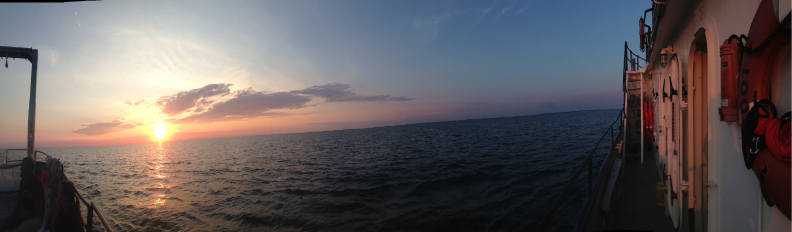  
- When I'm not doing science-y things, you can find me here:  
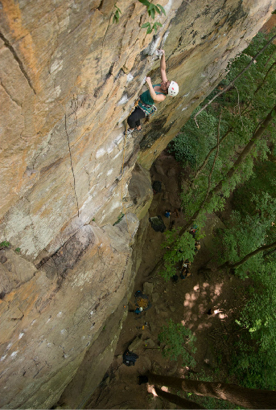 

***

## We scientists have a few problems  
- The [LaCour Scandal](http://fivethirtyeight.com/datalab/as-a-major-retraction-shows-were-all-vulnerable-to-faked-data/) of fabricated data published in *Science*.  
- Scientists in the United States spend [$28 billion](http://journals.plos.org/plosbiology/article?id=10.1371/journal.pbio.1002165) each year on basic biomedical research that cannot be repeated successfully  
- A reproducibility study in psychology found that only [39 of 100 studies could be reproduced](http://www.nature.com/news/first-results-from-psychology-s-largest-reproducibility-test-1.17433).  
    + A quote: *“A lot of working scientists assume that if it’s published, it’s right... This makes it hard to dismiss that there are still a lot of false positives in the literature.”*
- The Journal *Nature* on the [issue of reproducibility](http://www.nature.com/news/reproducibility-1.17552#/)  
    + A comment from the journal *Nature*: "Nature and the Nature research journals will introduce editorial measures to address the problem by improving the consistency and quality of reporting in life-sciences articles... **we will give more space to methods sections. We will examine statistics more closely and encourage authors to be transparent, for example by including their raw data.**"  
    + Nature also released a ["checklist"](http://www.nature.com/authors/policies/checklist.pdf) with an albeit *wimpy* computational check *(see #18)*.  
        + This talk will hopefully help all of us improve this step.

***

## How to replicate this Figure 1?
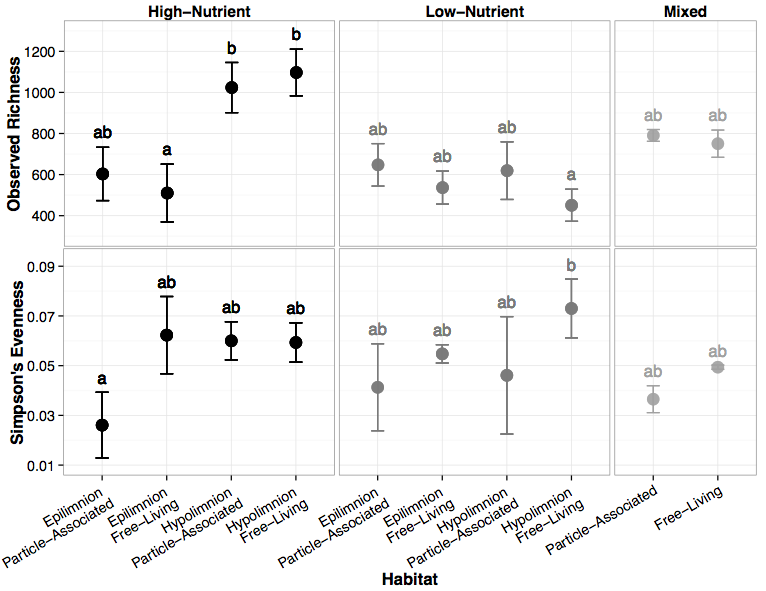

#### To replicate this figure 1, we need...  
- Sequencing data!
- All other data (i.e. where in the water column it was sampled, particle-association, which lake, nutrient profile, mixing status)  
- The code!  Which should be:  
    + Easily read-able  
    + Very well commented and documented.  
          + Using set.seed! 
    + How to calculate:  
        + Observed richness?  
        + Simpson's Evenness?  
- The versions of the software and packages/libraries used  

## Could I replicate Figure 1 from you last publication?  


***

## As scientists, it should be our goal to perform **robust** and **reproducible** research.

- "**Robust research** is about doing small things that stack the deck in your favor to prevent mistakes." *~Vince Buffalo*
- **Reproducible research** may be repeated by other researchers with the same results. 

### Reproducibility can be difficult with genomic data.  
1. Genomics data is too large and high dimensional to easily inspect or visualize.  Usually, workflows involve multiple steps and it's not feasible to inspect every step.  
2. Unlike in the wet lab, we don't always know what to expect of our genomics data analysis.  
3. It's difficult to distinguish *good* from *bad* results.  
4. Scientific code is usually only run once to generate results for a publication, and is therefore more likely to contain (silent) bugs.  
    + **Silent errors** arise from code that may produce unknowingly incorrect output (rather than stop with an error message).


### What are the ingredients to robust and reproducible research?  

- **Work must be well documented!  Methods, code, and data must be made available to others!**  
- Adopt a cautious attitude and *check everything*.    
    + Vince Buffalo's golden rule of bioinformatics:  "Never ever trust your tools (or data)"  
    + Remember, "garbage in, garbage out" - an analysis is only as good as the data going in.  
    + Let the data prove that it is high quality.
- **Take the time to develop fequently used scripts into tools.**  
    + Then have your lab mates or collaborators test them and try to break them.  
- **Collaborate!**  
    + Do paired-programming with your labmates and collaborators.  
    + Hack-a-thons! 


### What's the benefit for **_you?_**  
Yeah, it takes a lot of effort to be robust and reproducible.  However, *it will make your life (and science) easier!*  

- Most likely, you will have to re-run your analysis more than once.  
- In the future, you or a collaborator may have to re-visit part of the project.  
- You can make modularized parts of the project into re-useable tools for the future.  
- Reproducibility makes you easier to work and collaborate with.  

***

### 5 Recommendations for Robust Research  

#### 1a. Write code for humans

**Code readability is very important.**  

- Code should be broken down into small chunks that may be re-used.  
    + Do not re-write code to do the same task over and over again.  
        + Do not repeat yourself!  (Who wants to read that?)  
            + If you need to, make it a tool/function.  
- Do not require readers to have to think of multiple facts at once.  
- Make names/variables consistent, distinctive and meaningful.  
- Adopt a [style](https://github.com/google/styleguide) and format and keep it consistent.  
- Be a concise and clear commenter.  
    
If your code is more readable, then:  

- Your project is more reproducible.  
- It's easier to find and correct bugs.  
- You will be your friend in the future when you revisit the code.

#### 1b. Write data for computers

**Let your computer do the work for you**  
Format your data so its easily read by your computer, not by you or other humans.  

- Code written for people to read requires cleaning and tidying to be processed by a computer.  
- Name data files in a consistent way.  
    + Automating tasks will be easier, which will prevent you from making trivial mistakes.

#### 2. Make incremental changes.  
- Work in small steps with frequent feedback.  
    + Have a friend or labmate test your code and try to break it.  
    + Challenge your PI to test your code!
- Use version control!  
- Put all manual changes under version control, too! 


#### 3. Be a "Defensive Programmer" - Make Assertions  
Add tests within your code to make sure your code is doing what it is supposed to do.  

Assertions are statments that something holds true.  Assertions:  
1. Ensure that if something goes wrong, the program will stop.  
2. They also explain what the program is doing.

- In R you can use `stopifnot()`  
    + The `testthat` package is made for this!  Check it out the [testthat package here](http://journal.r-project.org/archive/2011-1/RJournal_2011-1_Wickham.pdf)  
- In python you can use `assert()`

#### 4. Use existing libraries (packages) whenever possible  
- Do not try to re-invent the wheel while your performing your data anaylsis.  
- Use functions that have already been written and tested for you.

#### 5. Prevent catastrophe and help reproducibility by making your data **read-only**
Read-only is important because:  

- Modifying data can corrupt your results.    
- It's easy to lose track of how you have changed a file when you modify it in place.  


#### 5 Recommendations for Robust Research  
1. Write code for humans, write data for computers 
2. Make incremental changes.
3. Make assertions and be loud, in code and in your methods  
4. Use existing libraries (packages) whenever possible  
5. Prevent catastrophe and help reproducibility by making your data **read-only** 


***

### 6 Recommendations for reproducible research  


#### 1. Encapsulate the full project into one directory that is supported with version control.  
The **Reproducible-Science-Curriculum** [Github repo for Reproducible Research Project Initialization](https://github.com/Reproducible-Science-Curriculum/rr-init) is a great place to start a reproducible research project.  

#### 2. Release your code and data
It is simple.  Without your code and data, your research is not reproducible.

#### 3. Document everything!   
**Bottom line:  Adopt a computing notebook that is as good as a wet-lab notebook**.

To fully reproduce a study, each step of analysis must be described in much more detail than can be included in a publication.

Include a record of your steps, where files are, where they came from, and what they contain.  

Include `session_info()` in your document, preferably at the bottom. Session info lists the version of R that you’re using plus all of the packages you’ve loaded. 

#### In your computing notebook:  

- Document your methods and workflows  
- Document the origin of all data in your project directory  
- Document **when** and **how** you downloaded the data  
- Record **data** version info   
- Record **software** version info with `session_info()`

For example, all the above information could be stored in a *README* file 


#### 4. Make figures, tables, and statistics the results of scripts.

Using `inline code` can make the creation of tables much easier if the data changes!

#### 5. Write code that uses relative paths.

Do not rely on hard-coded absolute paths (i.e. /Users/marschmi/Data/seq-data.csv or even ~/Data/seq-data.csv).  

Relative paths (i.e. Data/seq-data.csv) or command line arguments are better alternatives.

#### 6. Always Set your seed  

If there is any randomizations of data or simulations, use `set.seed()` in the first code chunk.

[Karl Browman](http://kbroman.org/knitr_knutshell/pages/reproducible.html) suggests to open R and type runif(1, 0, 10^8) and then paste the resulting large number into `set.seed()` in the first code chunk. If you do this, then the random aspects of your analysis should be repeated the same way.


#### 6 Recommendations for reproducible research  
1. Encapsulate the full project into one directory that is supported with version control.  
2. Release your code and data.  
3. Document everything and use code as documentation!
4. Make figures, tables, and statistics the results of scripts.  
5. Write code that uses relative paths.  
6. Always Set your seed.  


### How can you revise your work flow?  
Chat with your neighbor about your workflow.  

- Where you can introduce **robust** steps?  
- Where can you add **reproducible** steps?


***

## Do you have RStudio, R, and github all configured?
Yes?  Then, please install **Rmarkdown** and **knitr** 

`install.packages("knitr")`  
`install.packages("rmarkdown")` 

No?  Please take the time to do it now.  

***

## Using Git through RStudio  

### Git through RStudio  
1.  Sign into [GitHub](https://github.com/).  
2. [Initialize repo on the github page](http://angus.readthedocs.org/en/2015/CTB-github.html).  
    + Name the Repo "NGS_Reproducibility"  
3. Open up RStudio  
4. File -> New Project -> Version Control -> Git -> Copy and Paste the SSH clone URL.  
    + Be sure to use the same repo name as on your github page!

***

## RMarkdown Time!
    
    
### What is R Markdown?   
* RMarkdown is a variant of Markdown that has embedded R code chunks to be used with `knitr` to make it easy to create reproducible web-based reports.  
      + **Markdown:**  A system for writing simple, readable text that is easily converted to html. 
          + Allows you to write using an easy-to-read, easy-to-write plain text format.              
*  Rmd -> md -> html (docx, pdf)  
*  Can include both text and code to execute  
      
    
### Why R Markdown?
A convenient tool for reproducible and dynamic reports with R!       

- Execute code with `knitr`.   
- Easy to learn syntax.  
- Include LaTeX equations.  
- Don't need to worry about page breaks or figure placement.  
- Consolidate your code and write up into a single file:  
    + Slideshows, pdfs, html documents, word files  
- It's **so easy** to use with version control with Git!   

### Simple Workflow

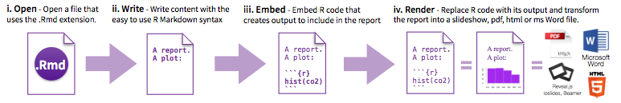


#### How to Open an Rmd File
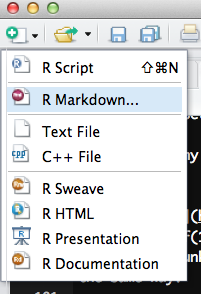  

#### How to Open an Rmd File
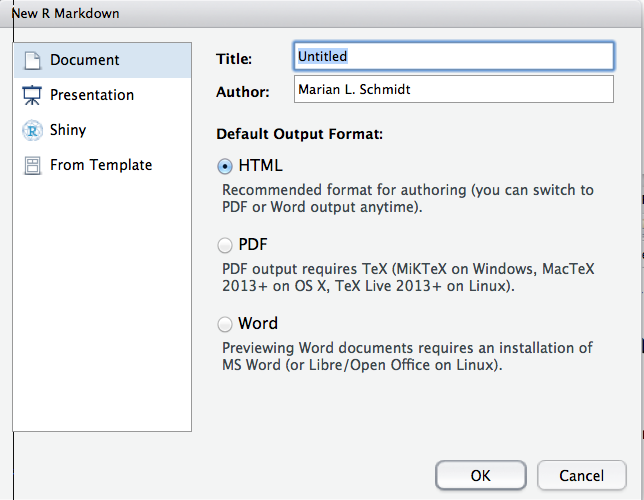


#### Choose Output
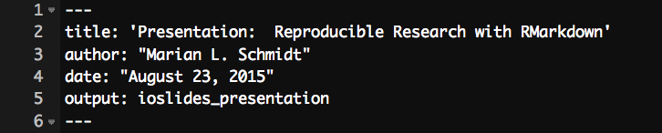

**YAML:**  A set of key value pairs at the start of your file.  Begin and end the header with a line of three dashes (- - -)

***R Studio template writes the YAML header for you***  

output: html_document  
output: pdf_document  
output: word_document  
output: beamer_presentation (beamer slideshow - pdf)  
output: ioslides_presentation (ioslides presentation - html)  


#### Markdown basics 
Markdown is a simple formatting language that is easy to use

- Create lists with `*` or `+` sign   
      + like this
      + and this
- Use one or two asterisk marks to provide emphasis such as `*`*italics*`*` and `**`**bold**`**`.  Can even include tables:    

First Header  | Second Header
------------- | -------------
Content Cell  | Content Cell
Content Cell  | Content Cell


#### Markdown basics 
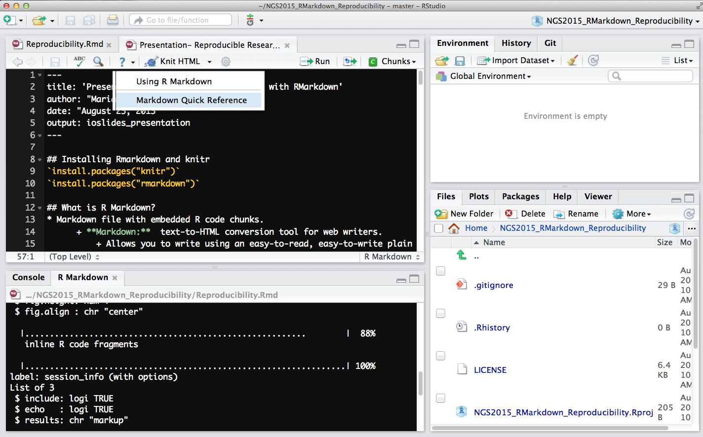

## R Code Chunks 

```
Code blocks display with fixed-width font
```

```{r fig.width = 4, fig.height = 3, message = FALSE}
#quick summary
library(ggplot2)
min(diamonds$price)
mean(diamonds$price)
max(diamonds$price)
```


#### More R Code Chunks 

```{r example chunk, echo = TRUE, eval = TRUE}
x <- sample(1:100, 5)
x
```

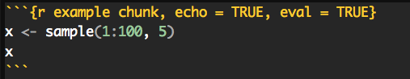

+ You can name the code chunk.  

+ echo = TRUE:  The code **will** be displayed.   

+ eval = TRUE: Yes, execute the code.

#### R Code Chunk Arguments


#### R Code Chunks:  Displaying Plots 
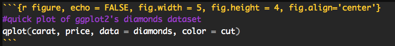

```{r figure, echo = FALSE, fig.width = 5, fig.height = 4, fig.align='center'}
#quick plot of ggplot2's diamonds dataset
qplot(carat, price, data = diamonds, color = cut)
```


### Global Chunk Options

You may want to use the same set of chunk options throughout a document and you don't want to retype those options in every chunk.  

**Global chunk options are for you!**

```{r global_options, include = FALSE}
knitr::opts_chunk$set(fig.width = 12, fig.height = 8, 
                      echo = FALSE, warning = FALSE, message = FALSE)
```

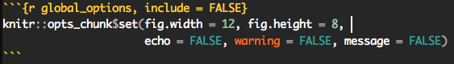


### Inline R Code  

You can evaluate expressions inline by enclosing the expression within a single back-tick qualified with `r`.  

Inline code is underappreciated!  

Last night, I saw `r 5 + 2` shooting stars!  


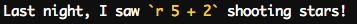


### Rendering document
1.  Run `rmarkdown::render("<filepath>")`  
2.  Click the very cute **knit HTML** button at the top of the RStudio scripts pane  

When you render, R will:  

- Execute each embedded code chunk and insert the results into your report.  

- Build a new version of your report in the output file type.  

- Open a preview of the output file in the viewer pane.  

-  Save the output file in your working directory.  


## Back to our Github Project within RStudio...

### Our Git Workflow within RStudio

1. Make a change to our document.  
2. Git add by checking box under "staged".  
3. Create our commit message.  
    + It should be a meaningful message!  
    + Think of you in 6 months looking for changes you had made.  Don't you want to be your own friend?  
4. Click "Commit."  
5. Git Push by clicking the "Push" button.  
6. Make sure everything is pushed to the remote repository without any errors.  

Click on the clock button to view your git history.  Here, you can also view the difference between documents.  


## [Multivariate statistics with R By Ryan Williams](https://github.com/ngs-docs/angus/blob/2015/week3/visualizations/multivariate-tests/tests.md) - Data from [Adina Howe's Lab](http://germslab.org/)   
Here, we are looking at transcript abundance within 12 different individual flys of three types of flies.  

### Within the Github Project we created earlier, let's make a file named "Practice.Rmd" with html output

### Let's make sure to set our seed first!

Let's create a random uniform distribution between `0` and `1e+08` and then copy and paste that into the `set.seed()` function.

```{r Set Seed, eval=FALSE, echo=TRUE}
#```{r Set Seed, eval=FALSE, echo=TRUE}
#runif(1, 0, 10^8)
set.seed(seed = 43855096)
#```
```


###  Install/Load Packages that we will use
```{r install packages, eval=FALSE, echo=TRUE}
#```{r install packages, eval=FALSE, echo=TRUE}
#install.packages("devtools")
library("devtools")
#install.packages("ggplot2")
library("ggplot2")
#install.packages("RCurl")
library("RCurl")
#install.packages("ggplot2")
library("ggplot2")
#install.packages("vegan")
library("vegan")
#```
```

```{r install packages2, eval=TRUE, echo=FALSE}
#```{r install packages2, eval=TRUE, echo=FALSE}
#install.packages("devtools")
library("devtools")
#install.packages("ggplot2")
library("ggplot2")
#install.packages("RCurl")
library("RCurl")
#install.packages("ggplot2")
library("ggplot2")
#install.packages("vegan")
library("vegan")
```


### Time to load in the data! 
```{r adonis, eval=FALSE, echo = TRUE}
#```{r adonis, eval=TRUE, echo = TRUE}
URL<-("https://raw.githubusercontent.com/ryanjw/ngs-3rdweek/master/visualizations/datasets/fly_data.txt")

dataset<-read.table(textConnection(getURL(URL)),header=T,check.names=F,sep="\t")
#```
```

```{r adonis2, eval=TRUE, echo = FALSE}
#```{r adonis, eval=TRUE, echo = TRUE}
URL<-("https://raw.githubusercontent.com/ryanjw/ngs-3rdweek/master/visualizations/datasets/fly_data.txt")

dataset<-read.table(textConnection(getURL(URL)),header=T,check.names=F,sep="\t")
#```
```

Let's look at the dataset that we loaded in

```{r dataset info, eval=TRUE, echo = TRUE, fig.width = 7, fig.height = 5, fig.align='center'}
#```{r dataset info, eval=TRUE, echo = TRUE, fig.width = 4, fig.height = 4, fig.align='center'}
dim(dataset) # Number of Rows, Number of columns 

head(dataset[,1:10]) # Look at the first 10 columns 

ggplot(dataset)+geom_histogram(aes(x=FBgn0000022,fill=fly,alpha=0.5)) + ggtitle("FBgn0000022 Transcript")# Plot a histogram of the distribution of the number of transcripts for the "FBgn0000022" transcript.
#```
```

### Standardize the data and then ask:  "Are the expression profiles different?"
```{r standardized adonis, echo=TRUE, eval = TRUE}
#```{r standardized adonis, echo=TRUE, eval = TRUE}
adonis(decostand(dataset[,-c(1:3)],method="total")~dataset$fly*dataset$type)
#```
```

### Are different transcripts present or absent between flys and types?
```{r presence/absence adonis, echo=TRUE, eval = TRUE}
#```{r presence/absence adonis, echo=TRUE, eval = TRUE}
adonis(decostand(dataset[,-c(1:3)],method="pa")~dataset$fly*dataset$type,method="jaccard")
#```
```


###  [Data Visualizations from Ryan Williams](https://github.com/ngs-docs/angus/blob/2015/week3/visualizations/multivariate-viz/visualizations.md) 
```{r visualizations, eval=TRUE, echo = TRUE, fig.width = 7, fig.height = 5, fig.align='center'}
#```{r visualizations, eval=TRUE, echo = TRUE, fig.width = 7, fig.height = 5, fig.align='center'}
URL<-("https://raw.githubusercontent.com/ryanjw/ngs-3rdweek/master/visualizations/multivariate-viz/fly_data_with_unknowns.txt")
fly_unknowns<-read.table(textConnection(getURL(URL)),header=T,check.names=F,sep="\t")

head(fly_unknowns[,1:10])
tail(fly_unknowns[,1:10])

 mds<-metaMDS(fly_unknowns[,-c(1:4)],distance="bray",autotransform=F,k=3 )
 sc<-data.frame(scores(mds),fly_unknowns[,1:3])
 head(sc)

 ggplot(sc, aes(x=NMDS1,y=NMDS2, color = type))+geom_point()
```


Always remember to included session info for reproducibility!

```{r session_info, eval = FALSE, include=TRUE, echo=TRUE, results='markup'}
#```{r session_info, eval = FALSE, include=TRUE, echo=TRUE, results='markup'}
 devtools::session_info()
```


## Resources for Reproducible Research  
- Vince Buffalo's [Bioinformatics Data Skills](http://www.amazon.com/Bioinformatics-Data-Skills-Reproducible-Research/dp/1449367372) book and it's helpful [github page](https://github.com/vsbuffalo/bds-files)  
    + Main source for this presentation.
- A course by Dr. Karl Browman at the University of Wisconsin-Madison on [Reproducible Research.](http://kbroman.org/Tools4RR/)  
- Reproducible-Science-Curriculum [Github repo for Reproducible Research Project Initialization](https://github.com/Reproducible-Science-Curriculum/rr-init)  
- ROpenSci [Reproducibility Research](http://ropensci.github.io/reproducibility-guide/) guidelines  
- [Best Practices for Scientific Computing](http://journals.plos.org/plosbiology/article?id=10.1371/journal.pbio.1001745) by Wilson et al., 2014  
- [Stats Dept. Resources from U-Wisconsin](https://www.stat.wisc.edu/reproducible)

## Resources for Rmarkdown, RStudio and R  
- Yihui Xie's "[Dynamic Documents with R and Knitr](http://www.amazon.com/Dynamic-Documents-knitr-Chapman-Series/dp/1482203537)" and it's [github page](https://github.com/yihui/knitr-book/).  
- [RMarkdown Quick Reference Guide](https://www.rstudio.com/wp-content/uploads/2015/03/rmarkdown-reference.pdf) - Christopher Gandrud's "[Reproducible Research with R and RStudio](http://www.amazon.com/Reproducible-Research-Studio-Chapman-Series/dp/1466572841)" and it's github page
- [RStudio RMarkdown Documentation](http://rmarkdown.rstudio.com/)  
- [Rmd Cheatsheet](http://www.rstudio.com/wp-content/uploads/2015/02/rmarkdown-cheatsheet.pdf)
- [Knitr Reference Card](http://cran.r-project.org/web/packages/knitr/vignettes/knitr-refcard.pdf)  
- [R Cookbook for ggplot](http://www.cookbook-r.com/Graphs/)


## Session Info  
[Dr. Karl Broman](http://kbroman.org/knitr_knutshell/pages/reproducible.html) recommends using the `session_info()` from the devtools package.
```{r Presentation session_info, include=TRUE, echo=TRUE, results='markup'}
devtools::session_info()
```


